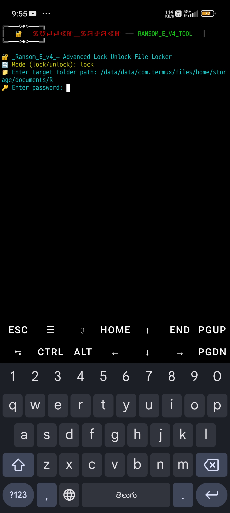

<h1 align="center">🔐 Ransom_eE_4v</h1>

<p align="center">
💣 Python ఆధారిత ఫైల్ ఎన్‌క్రిప్షన్ టూల్ <br>
📘 Strictly for Educational Purpose only! <br>
</p>

---


## 📌 Overview

> ⚠️ This tool is intended **only for ethical hacking, cybersecurity learning, and educational use**.

**Ransom_eE_4v** is a Python script that simulates ransomware-like encryption/decryption, allowing users to learn how file-level encryption works.

---

## ✨ Features

- 🔐 AES-based **file encryption & decryption**
- 🔑 Password protection with unlock prompt
- 💣 Auto **self-destruct** after wrong attempts
- 🧠 **Educational simulation only**
- ☁️ GitHub backup supported (for `.locked` files)

---

## 📁 Files Included

| Filename          | Description                                |
|-------------------|--------------------------------------------|
| `Ransom_eE_4v.py` | Main script with encryption & decryption   |
| `README.md`       | Stylish info file you're reading now 😉     |
| `LICENSE`         | MIT License - Open source permission       |
| `keys.txt` _(opt)_| Password/key storage (only for testing!)  |

---

## ⚙️ How to Run

```bash
python Ransom_eE_4v.py


# Ransome_eE_4v
# 🔐 RANSOM_E_V4_TOOL — ఫైల్ లాకింగ్ మరియు అన్‌లాక్ టూల్

**ఈ టూల్ సెక్యూర్ ఫైల్ లాకింగ్ మరియు అన్‌లాక్ ప్రాసెస్ కోసం రూపొందించబడింది.**  
పాస్‌వర్డ్ ఆధారిత ఎన్‌క్రిప్షన్, రిమోట్ అన్‌లాక్, మరియు సెల్ఫ్ డిస్ట్రాయ్ ఫీచర్లతో వస్తుంది.

---

## 🌟 ఫీచర్లు

- 🔒 **ఫైల్ లాక్ / అన్‌లాక్** – AES ఆధారిత ఫెర్నెట్ ఎన్‌క్రిప్షన్ ద్వారా.
- 🔐 **పాస్‌వర్డ్ ప్రొటెక్షన్** – తప్పు పాస్‌వర్డ్ 3 సార్లు ఇచ్చినపుడు డేటా డిలీట్.
- ☁️ **రిమోట్ అన్‌లాక్** – GitHub నుండి రిమోట్ కీ ద్వారా ఫైళ్లను రికవర్ చేయవచ్చు.
- ☠️ **సెల్ఫ్ డిస్ట్రాయ్** – తప్పు పాస్‌వర్డ్ 3 సార్లు ఇస్తే `.locked` ఫైళ్లను డిలీట్ చేస్తుంది.
- ✅ **క్లియర్ కలర్ అవుట్‌పుట్** – వాడుకదారుని కన్ఫ్యూజన్ లేకుండా చూపించడానికి.

---

## 🧰 ఉపయోగించే ప్యాకేజ్లు

- `cryptography`
- `colorama`
- `requests`
- `getpass`
- `hashlib`, `base64`, `os`, `time`

---

## 🛠️ ఇన్‌స్టాలేషన్ (Termuxలో)

```bash
pkg update && pkg upgrade
pkg install python
pip install cryptography colorama requests
```
## ▶️ వాడే విధానం
## ⚠️ హెచ్చరిక PASSWORD 1234
```
git clone https://github.com/sunnamsriram1/Ransome_eE_4v.git
cd Ransome_eE_4v
bash Ransom_eE_4v.py
```
## 🎛️ Mode ఎంచుకోండి:
- lock – ఫైళ్లను .locked ఫార్మాట్‌లో encrypt చేస్తుంది.
- unlock – .locked ఫైళ్లను డిక్రిప్ట్ చేసి restore చేస్తుంది.

## 📝 అడిగే సమాచారం:
- 📁 టార్గెట్ ఫోల్డర్ పాత్
- 🔑 పాస్‌వర్డ్ (లాకింగ్ / అన్‌లాక్ చేయడానికి)

## 📦 రిమోట్ అన్‌లాక్ కీ సెటప్
- GitHub లో key.json అనే ఫైల్ క్రింద విధంగా ఉండాలి:

```
 {
  "remote_key": "మీ_సీక్రెట్_కీ"
 }
```
- ఈ ఫైల్‌ను GitHub లో పబ్లిక్‌గా అప్‌లోడ్ చేయాలి
- (లేదా GitHub Token వాడి ప్రైవేట్ రిపోలో యాక్సెస్ కలిపించాలి).

## ⚠️ హెచ్చరిక
- ✅ ఎడ్యుకేషనల్ పర్పస్ కోసమే వాడండి.
- ❌ ఇతరుల వ్యక్తిగత డేటా లేదా వ్యవస్థలపై ప్రయోగించవద్దు.
- 💣 ఫైళ్లను తిరిగి పొందలేనివిగా మార్చే ప్రమాదం ఉంది – జాగ్రత్తగా వాడండి.

- 🔐 Ransom_eE_4v_Self-Destruct.py టూల్ – ఫైల్ ఎన్‌క్రిప్షన్ & సెల్ఫ్ డిస్ట్రక్స్ ఫీచర్‌తో
- ఈ టూల్ మీ వ్యక్తిగత డేటాను సురక్షితంగా లాక్ చేయడానికి రూపొందించబడింది. ఇది ఎన్‌క్రిప్ట్ చేసిన డేటాను తప్పుడు పాస్వర్డ్ 3 సార్లు ఇచ్చినప్పుడు స్వయంగా డిలీట్ - - (Self-Destruct) చేస్తుంది.

## 📌 ఫీచర్లు:
- ✅ ఫైళ్లను పాస్వర్డ్ ప్రొటెక్షన్‌తో ఎన్క్రిప్ట్ చేయండి
- ✅ పాస్వర్డ్ ఇచ్చి తిరిగి డీక్రిప్ట్ చేయండి
- ✅ 3 సార్లు తప్పు పాస్వర్డ్ ఇచ్చినప్పుడు డేటా శాశ్వతంగా డిలీట్ అవుతుంది (Self-Destruct)
- ✅ అన్ని ఫైల్ టైప్స్ (.txt, .pdf, .jpg, .mp4, .apk, .py, .mp3, .zip...) కి సపోర్ట్
- ✅ రాండమ్ ఫైలుపేర్లతో డేటా హైడ్ చేయబడుతుంది
- ✅ లాక్ చేసిన ఫైళ్ళు .locked ఫార్మాట్ లో సేవ్ అవుతాయి
- ✅ లాకింగ్ & అన్‌లాకింగ్ లాగ్ ఫైల్‌తో ట్రాకింగ్

1. మీ ఫైళ్లను ఎన్‌క్రిప్ట్ చేయండి:
స్క్రిప్ట్ రన్ చేసిన తర్వాత, Lock Unlock అడుగుతుంది పాస్వర్డ్ సెట్ చేయండి

మీరు ఎన్‌క్రిప్ట్ చేయాలనుకుంటున్న ఫోల్డర్ పేరు (path) ఇవ్వండి

ఎన్‌క్రిప్ట్ అయిన ఫైళ్లు Encrypted/ లోకి మౌవ్ అవుతాయి

2. డీక్రిప్ట్ చేసేటప్పుడు:
అదే పాస్వర్డ్ ఇవ్వాలి

3 సార్లు తప్పు పాస్వర్డ్ ఇస్తే – సెల్ఫ్ డిస్ట్రక్స్: 🔥 encrypted files శాశ్వతంగా డిలీట్ అవుతాయి

## ⚠️ జాగ్రత్తలు:
🚫 పాస్వర్డ్ మర్చిపోతే లేదా 3 సార్లు తప్పిస్తే మీ డేటా తిరిగి పొందడం అసాధ్యం
🔐 ఇది హై సెక్యూరిటీ టూల్ – ప్రయోగాత్మకంగా ఉపయోగించండి
📁 అసలు డేటాను లాక్ చేయడానికి ముందు బ్యాక్‌అప్ తీసుకోవడం ఉత్తమం

## 💬 "మీ వ్యక్తిగత గోప్యతకు హక్కు ఉంది. దాన్ని కాపాడుకోండి." – Sunnam Sriram 

# 👨‍💻 Coded by
## Sunnam Sriram
## 📅 Updated: 2025 Aug 3
## 🔗 GitHub: sunnamsriram1
